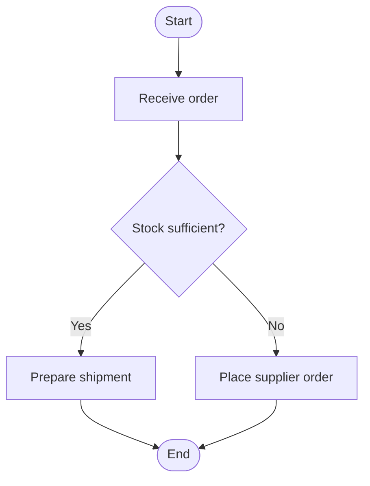

# Flowchart Advanced

---

## Swim lanes

Swim lanes divide the flowchart into vertical or horizontal bands, each assigned to an actor, department, or system. They show **who does what** in a process involving multiple stakeholders.

Rules:
- Each step (rectangle or diamond) belongs to exactly one lane.
- Arrows can cross lane boundaries to show handoffs between stakeholders.
- Decisions can trigger actions in other lanes.

---

## Levels of detail

The same process can be represented at different levels of granularity.

| Level | Content | Use case |
|-------|---------|----------|
| **Macro** | Major steps only, 5–10 blocks | High-level overview, non-technical audience |
| **Intermediate** | Sub-steps and decisions visible | Functional documentation |
| **Micro** | Every elementary operation | Technical documentation, algorithms |

> Always start at the macro level before breaking down. A flowchart that is too dense becomes unreadable.

---

## Subprocesses and decomposition

A rectangle with side bars represents a subprocess: a process detailed in a separate flowchart. It is the graphical equivalent of a function call.

Benefits:
- Reduces complexity in the main flowchart.
- Reuses a common process referenced in multiple places.
- Enables hierarchical decomposition of a system.

Name each subprocess with a clear identifier (`P1`, `CHECK_STOCK`…) and associate it with its own detailed flowchart.

---

## Step numbering

In industrial or regulatory process flowcharts, each block receives a unique identifier.

```
1.0  Start
1.1  Receive order
1.2  Stock available?  →  Yes → 1.3  /  No → 1.4
1.3  Prepare shipment
1.4  Place supplier order
1.5  End
```

Benefits: traceability, cross-referencing in documentation, audit reviews.

---

## Data flow diagram (DFD)

Distinct from the classic control flowchart, a **DFD** focuses on data rather than execution flow.

| Element | Representation | Role |
|---------|----------------|------|
| External entity | Rectangle | Source or destination of data |
| Process | Circle / oval | Data transformation |
| Data flow | Named arrow | Data in transit |
| Data store | Open rectangle | Intermediate storage |

> A DFD contains no decisions or control structures — it does not model the order of execution.

---

## Best practices

Readability:
- Consistent reading direction from start to finish (top → bottom preferred).
- Space blocks evenly and align elements on a grid.
- Keep blocks per page under 30 — beyond that, decompose into subprocesses.

Precision:
- Name each process with an **action verb** in the infinitive: `Validate order`, `Calculate tax`.
- Diamonds ask a **closed question**: `Stock sufficient?`, `User logged in?`
- Never put multiple actions in a single rectangle.

Maintenance:
- Date and version the flowchart (`v1.2 — 2025-03`).
- Include the author and scope.
- Update the flowchart every time the real process changes.

---

## Common tools

| Tool | Type | Use case |
|------|------|----------|
| draw.io / diagrams.net | Web, free | General use, SVG/PNG export |
| Lucidchart | Web, paid | Team collaboration |
| Microsoft Visio | Desktop, paid | Microsoft ecosystem, ISO standards |
| Mermaid | Text (Markdown) | Flowcharts inside code documentation |
| PlantUML | Text | Integration with dev tools |

---

## Flowcharts in Mermaid

Mermaid generates a flowchart directly inside a Markdown file (GitHub, Notion, GitLab…).

````markdown

````

| Directive | Effect |
|-----------|--------|
| `flowchart TD` | Top → bottom direction |
| `flowchart LR` | Left → right direction |
| `A([text])` | Terminal (oval) |
| `A[text]` | Process (rectangle) |
| `A{text}` | Decision (diamond) |
| `A[\text/]` | Input / Output (parallelogram) |
| `A[[text]]` | Subprocess |
| `A[(text)]` | Database (cylinder) |
| `-->` | Plain arrow |
| `-->|label|` | Arrow with label |
